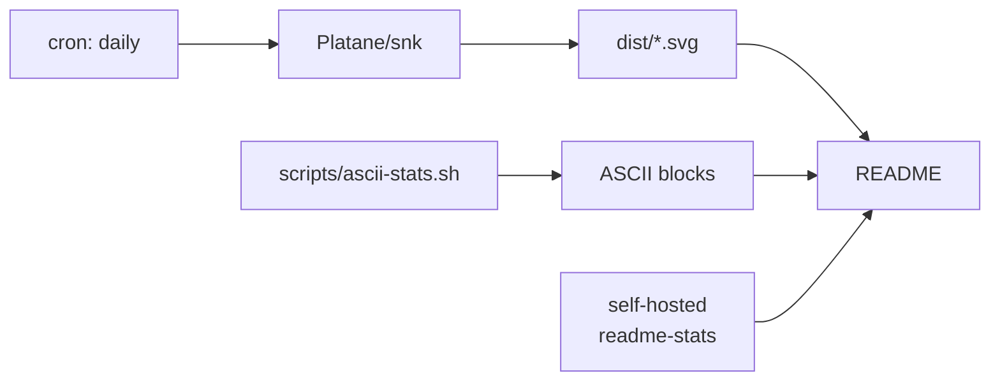

```
    ██████╗ ██╗  ██╗ █████╗ ██████╗ ███████╗ █████╗ ███╗   ██╗
    ██╔══██╗██║  ██║██╔══██╗██╔══██╗██╔════╝██╔══██╗████╗  ██║
    ██║  ██║███████║███████║██████╔╝███████╗███████║██╔██╗ ██║
    ██║  ██║██╔══██║██╔══██║██╔══██╗╚════██║██╔══██║██║╚██╗██║
    ██████╔╝██║  ██║██║  ██║██║  ██║███████║██║  ██║██║ ╚████║
    ╚═════╝ ╚═╝  ╚═╝╚═╝  ╚═╝╚═╝  ╚═╝╚══════╝╚═╝  ╚═╝╚═╝  ╚═══╝
         l o c a l - f i r s t   ·   t o o l s   I   u s e
```

<!--WHOAMI:START-->
```
dharsan@github
──────────────────────────────────────────────────
  repos ........ 20 authored
  commits ...... 3,404
  lines ........ 694,302
  focus ........ local-first, offline-capable
  editor ....... nvim, Xcode when forced
  building ..... Avorio · backglass · agent-bridge
──────────────────────────────────────────────────
```
<!--WHOAMI:END-->

Software engineer building local-first apps and developer tooling. Most of what I write
runs on my own machine before it runs on anyone else's.

### Avorio

The one I keep coming back to. A native flashcard app for macOS, iOS, and Android —
FSRS-5 spaced repetition with the gamification loop that actually keeps people
reviewing. Closed source for now.

```
                    ┌───────────────────────────────┐
    SwiftUI ───────►│                               │
    (macOS, iOS)    │   avorio-ffi    UniFFI        │
                    │       │                       │
    Compose ───────►│   avorio-core   FSRS-5, cards,│
    (Android)       │       │         import, AI,   │
                    │   avorio-db     plugins, auth │
                    │       │                       │
                    │   rusqlite  ──►  local file   │
                    └───────────────────────────────┘
              one Rust core, three native front ends
```

- **FSRS-5** — 19-parameter model, adaptive steps, leech detection, and an optimizer
  that retunes weights against your own review history
- **Offline by construction** — rusqlite on disk, PIN + biometric lock, no account,
  no sync service to depend on
- **Anki import** — `.apkg` / `.spkg` / `.colpkg` with media, HTML, cloze, and CSS preserved
- **AvBrain** — generates cards from PDFs and documents. Runs on-device via Ollama on
  Mac and Apple Intelligence on iOS, so the free tier needs no API key and no gateway
- **WASM plugins** — `wasmi` sandbox with hook points for custom schedulers and importers
- **One core, three front ends** — business logic lives in Rust once; SwiftUI and
  Jetpack Compose are views over the same `AvorioDatabase` facade

### Also building

```
  ┌─ backglass ───────────────────────────────────────────────────┐
  │  Second brain. Reads mail and files into a commitment ledger  │
  │  with documents as evidence. Python · SQLite · on-device.     │
  └───────────────────────────────────────────────────────────────┘
  ┌─ agent-bridge ────────────────────────────────────────────────┐
  │  Rust bridge for cross-agent LLM workflows.                   │
  └───────────────────────────────────────────────────────────────┘
  ┌─ cogwait ─────────────────────────────────────────────────────┐
  │  MIT sponsor line for the Claude Code status row. Never reads │
  │  your code, files, or prompts. Client and ad server auditable.│
  └───────────────────────────────────────────────────────────────┘
```

[backglass](https://github.com/contactdharsan-blip/backglass) ·
[agent-bridge](https://github.com/contactdharsan-blip/agent-bridge) ·
[cogwait](https://github.com/Cognifer-Labs/cogwait)

### What I actually write

<!--LANGS:START-->
```
  Kotlin       ████████████████████████████████████████  132,519
  TypeScript   █████████████████████████████████████░░░  123,913
  Swift        █████████████████████████████████░░░░░░░  108,802
  Python       ████████████████████████████░░░░░░░░░░░░   94,201
  JavaScript   ████████████████████████████░░░░░░░░░░░░   93,629
  Rust         ███████████████████████░░░░░░░░░░░░░░░░░   76,086
  SQL          ██████░░░░░░░░░░░░░░░░░░░░░░░░░░░░░░░░░░   19,663
  HTML         ████░░░░░░░░░░░░░░░░░░░░░░░░░░░░░░░░░░░░   13,674
  CSS          ████░░░░░░░░░░░░░░░░░░░░░░░░░░░░░░░░░░░░   12,995
  C/C++        ███░░░░░░░░░░░░░░░░░░░░░░░░░░░░░░░░░░░░░    9,399
  Shell        ███░░░░░░░░░░░░░░░░░░░░░░░░░░░░░░░░░░░░░    8,784

  694,302 lines of source across 20 repos, vendored code excluded
```
<!--LANGS:END-->

<div align="center">

[](https://skillicons.dev)

</div>

### Stats

<div align="center">

<!-- No github-readme-stats card here on purpose. The public instance is
     DEPLOYMENT_PAUSED, and a self-hosted one would need a repo-scoped token
     parked in a third party's environment just to render a picture. The ASCII
     block above reports the same numbers, computed locally, from every repo
     rather than only the public ones. -->


<picture>
  <source media="(prefers-color-scheme: dark)" srcset="dist/github-snake-dark.svg" />
  <source media="(prefers-color-scheme: light)" srcset="dist/github-snake.svg" />
  
</picture>

</div>

<details>
<summary><b>More projects</b></summary>

<br />

Repos by their canonical name. Private ones are listed without a link, because a
link you cannot open is worse than no link.

```
  PUBLIC
  Dustpan ......................... macOS storage cleaner        Swift
  website-of-me ................... résumé site                  TypeScript
  social-media-pinger ............. cross-post scheduler         Kotlin
  misinformation-simulation-aoa ... agent-based sim              C++
  Misinformation-simulator- ....... earlier take on the same     Python
  agent-bridge-profile-skill ...... cross-agent coder profile    Python

  PRIVATE
  Avorio .......................... flashcard app                Rust · Swift · Kotlin
  BioPath ......................... compound-effect model        Python
  ClaimBack ....................... refund claim tracker         TypeScript
  backglass-private ............... upstream of backglass        Python
  Cognifer-Labs/cognifer-web ...... company site                 TypeScript
  Cognifer-Labs/alojefe ........... contractor SaaS landing      TypeScript
  Cognifer-Labs/time-tracker ...... time tracking                TypeScript
  Tembo ........................... earlier work                 TypeScript
```

[Dustpan](https://github.com/contactdharsan-blip/Dustpan) ·
[website-of-me](https://github.com/contactdharsan-blip/website-of-me) ·
[social-media-pinger](https://github.com/contactdharsan-blip/social-media-pinger) ·
[misinformation-simulation-aoa](https://github.com/contactdharsan-blip/misinformation-simulation-aoa) ·
[Misinformation-simulator-](https://github.com/contactdharsan-blip/Misinformation-simulator-) ·
[agent-bridge-profile-skill](https://github.com/contactdharsan-blip/agent-bridge-profile-skill)

</details>

<details>
<summary><b>How this profile is built</b></summary>

<br />



Everything that can be generated locally is, and committed. Remote widgets are the
parts I'm willing to see break.

</details>

```
─────────────────────────────────────────────────────────────────
  contactdharsan@gmail.com                  github.com/contactdharsan-blip
─────────────────────────────────────────────────────────────────
```
