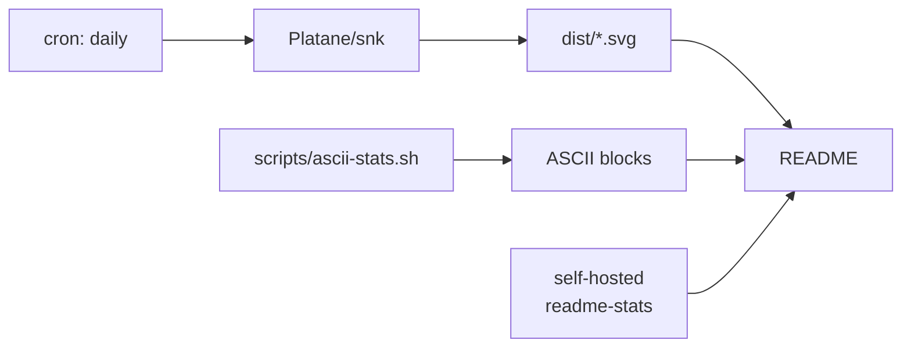

```
    ██████╗ ██╗  ██╗ █████╗ ██████╗ ███████╗ █████╗ ███╗   ██╗
    ██╔══██╗██║  ██║██╔══██╗██╔══██╗██╔════╝██╔══██╗████╗  ██║
    ██║  ██║███████║███████║██████╔╝███████╗███████║██╔██╗ ██║
    ██║  ██║██╔══██║██╔══██║██╔══██╗╚════██║██╔══██║██║╚██╗██║
    ██████╔╝██║  ██║██║  ██║██║  ██║███████║██║  ██║██║ ╚████║
    ╚═════╝ ╚═╝  ╚═╝╚═╝  ╚═╝╚═╝  ╚═╝╚══════╝╚═╝  ╚═╝╚═╝  ╚═══╝
         l o c a l - f i r s t   ·   t o o l s   I   u s e
```

<div align="center">

[](https://git.io/typing-svg)

</div>

<!--WHOAMI:START-->
```
dharsan@github
──────────────────────────────────────────────────
  repos ........ 19 authored
  commits ...... 3,401
  lines ........ 693,665
  focus ........ local-first, offline-capable
  editor ....... nvim, Xcode when forced
  building ..... Avorio · backglass · agent-bridge
──────────────────────────────────────────────────
```
<!--WHOAMI:END-->

Software engineer building local-first apps and developer tooling. Most of what I write
runs on my own machine before it runs on anyone else's.

<h3>▚ Currently building</h3>

```
  ┌─ Avorio ──────────────────────────────────────────────────────┐
  │  Cross-platform app. Kotlin/Compose · SwiftUI · Rust · Tauri  │
  └───────────────────────────────────────────────────────────────┘
  ┌─ backglass ───────────────────────────────────────────────────┐
  │  Second brain. Reads mail + files into a commitment ledger.   │
  │  Python · SQLite · runs entirely on device.                   │
  └───────────────────────────────────────────────────────────────┘
  ┌─ agent-bridge ────────────────────────────────────────────────┐
  │  Rust bridge for LLM agent workflows.                         │
  └───────────────────────────────────────────────────────────────┘
```

<h3>▚ What I actually write</h3>

<!--LANGS:START-->
```
  Kotlin       ████████████████████████████████████████  132,519
  TypeScript   █████████████████████████████████████░░░  123,913
  Swift        █████████████████████████████████░░░░░░░  108,802
  Python       ████████████████████████████░░░░░░░░░░░░   93,718
  JavaScript   ████████████████████████████░░░░░░░░░░░░   93,629
  Rust         ███████████████████████░░░░░░░░░░░░░░░░░   76,086
  SQL          ██████░░░░░░░░░░░░░░░░░░░░░░░░░░░░░░░░░░   19,663
  HTML         ████░░░░░░░░░░░░░░░░░░░░░░░░░░░░░░░░░░░░   13,674
  CSS          ████░░░░░░░░░░░░░░░░░░░░░░░░░░░░░░░░░░░░   12,995
  C/C++        ███░░░░░░░░░░░░░░░░░░░░░░░░░░░░░░░░░░░░░    9,399
  Shell        ███░░░░░░░░░░░░░░░░░░░░░░░░░░░░░░░░░░░░░    8,630

  693,665 lines of source across 19 repos, vendored code excluded
```
<!--LANGS:END-->

<div align="center">

[](https://skillicons.dev)

</div>

<h3>▚ Stats</h3>

<div align="center">

<!-- Stats card is commented out until it is self-hosted. The public
     github-readme-stats instance is DEPLOYMENT_PAUSED, and only a deployment
     using my own token can set count_private=true. To enable: fork
     anuraghazra/github-readme-stats, deploy to Vercel, set PAT_1, then
     replace STATS_HOST below and uncomment.


-->


<picture>
  <source media="(prefers-color-scheme: dark)" srcset="dist/github-snake-dark.svg" />
  <source media="(prefers-color-scheme: light)" srcset="dist/github-snake.svg" />
  
</picture>

</div>

<details>
<summary><b>▚ More projects</b></summary>

<br />

```
  BioPath ............. medication identification            Python
  Dustpan ............. macOS cleanup utility                Swift
  website-of-me ....... personal site                        TypeScript
  social-media-pinger . cross-post scheduler                 Kotlin
  ClaimBack ........... refund claim tracker                 TypeScript
  cognifer-web ........ company site                         TypeScript
  Tembo ............... ↑ earlier work                       TypeScript
```

</details>

<details>
<summary><b>▚ How this profile is built</b></summary>

<br />



Everything that can be generated locally is, and committed. Remote widgets are the
parts I'm willing to see break.

</details>

```
─────────────────────────────────────────────────────────────────
  contactdharsan@gmail.com                  github.com/contactdharsan-blip
─────────────────────────────────────────────────────────────────
```
